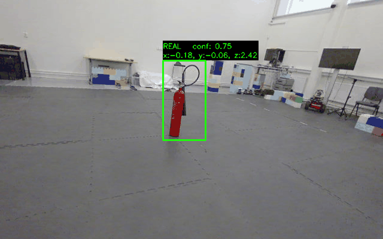

# Object Detection and Localization

## Team  
- Joar Bertholdsson
- Albin Erickson
- Hampus Kämppi

## Files
- `object_detection.ipynb`: Contains YOLO Training
- `main.ipynb`: Contains entire pipeline and plotting
- `main.py`: Runs pipeline as in `main.ipynb`, used to track time. 
- `utils.py`: Contains all the helper functions used in pipeline (main function of interest is `get_detected_object_xyz()`)

## Requirements
Required packages are found in `requirements.txt` 

`pip install -r requirements.txt`